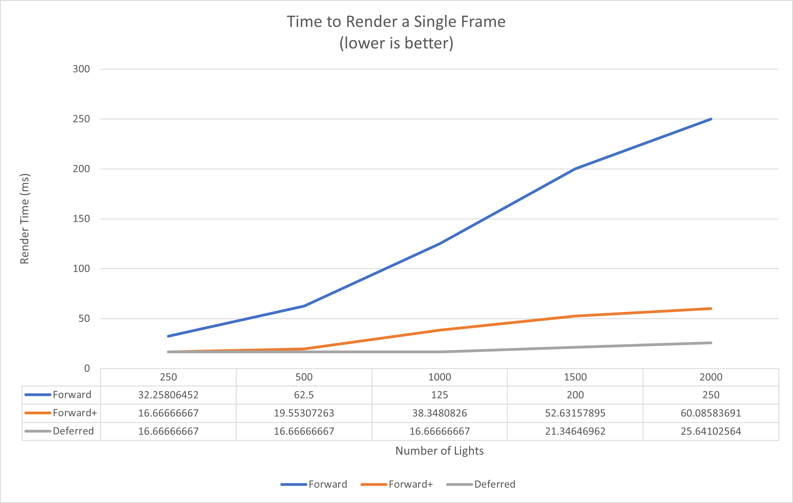
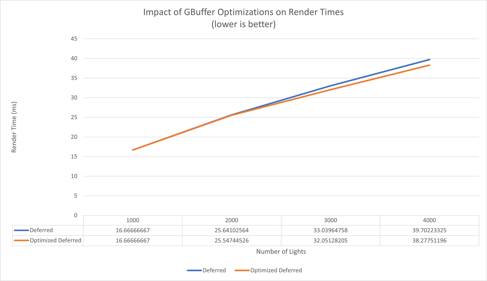
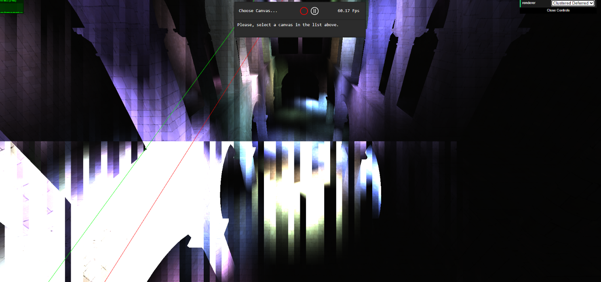
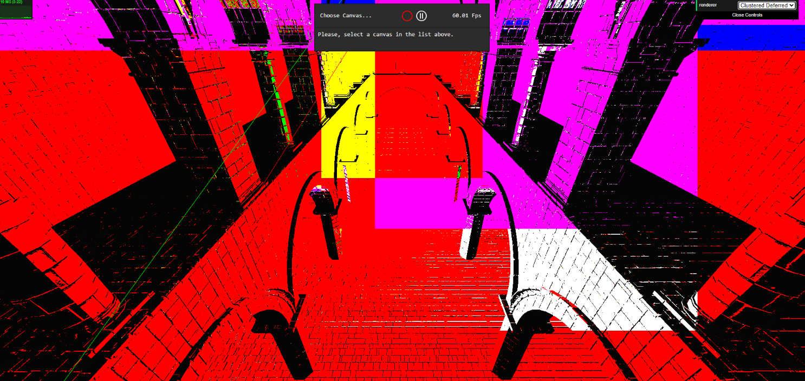
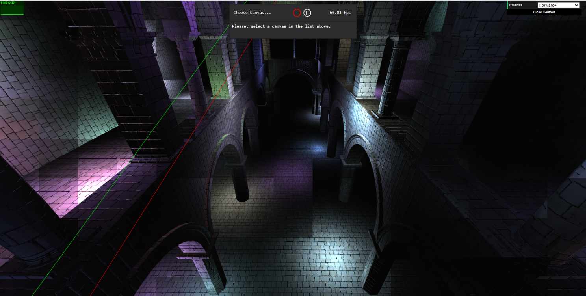

WebGL Forward+ and Clustered Deferred Shading
======================

**University of Pennsylvania, CIS 565: GPU Programming and Architecture, Project 5**

* Stephen Lee
* Tested on: **Google Chrome  95.0.4638.54** on
  Windows 10, i7-9750H @2.60GHz, RTX 2060 6GB (personal laptop)

### Live Online

### Demo Video/GIF

The gif file is too large to upload to github. It can be accessed here instead: https://drive.google.com/file/d/1Xd6pp6F3XdV6gltzo06OcMF4TP0W7-FW/view?usp=sharing

# Project Overview

The goal of this project was to compare different rendering techniques in a scene with many moving lights. The algorithms implemented were a Forward+ renderer and a Clustered Deferred renderer. A standard Forward renderer was provided in the base code as a point of comparison to the more optimized algorithms implemented.

### Forward Renderer
This algorithm provides a simplistic approach to rendering a scene. In the implementation provided, we draw each lit object and for each pixel in the scene, we check each light to see whether or not it contrbutes to each pixel. This leads to many unecessary light checks that are optimized out in the Forward+ implementation.

### Forward+ Renderer
Building off the foundations of the standard Forward rendering algorithm, Forward+ optimizes our approach by no longer requring us to check each pixel in the scene against each light in the scene to see if it impacts the pixel. We accomplish this by first pre-computing clusters of lights in a 3D grid to narrow down the search space for each light to only be the clusters that it can impact. We can the leverage this while shading the scene such that pixels only need to be checked against lights within relevant clusters.

### Clustered Deferred Renderer
Finally, we take a different approach by using deferred shading. In deferred shading, we draw each object in the scene to GBuffers (geometry buffers), and for each pixel in the GBuffer, we can check for which lights contribute to it. We can then apply the same clustering logic from Forward+ to cut down on the number of lights we need to check per pixel.

### Features Implemented
Rendering Algorithms
* Forward+ rendering pipeline
* Clustered Deferred rendering pipeline

Effects
* Deferred Blinn-Phong shading for point lights

GBuffer Optimizations
* Packing values together in vec4s
* 2-component normals

# Performance Analysis
Each feature tested in the sections below were done in isolation of the other features tested.

### Comparing Algorithms

To start, each of the algorithms were tested without any optimizations and additional effects to get a baseline for their performance with varying numbers of lights present in the scene. This performance can be attributed to the optimizations in light clustering as well as the fact that pre-computing object properties and storing them in GBuffers helps to separate scene complexity from the lighting computations. The Clustered Deferred renderer performed the best with every number of lights. Both the Forward+ and Clustered Deferred rendering algorithms provide a signifiant boost in performance when compared to a standard Forward rendering approach by the clustering optimization that cuts down on the number lights that need to be checked. This is especially important as light counts go up, making the Forward rendered scene almost unusable, while the other two are still pretty smooth.

One limitation to these measurements is that I'm not completely sure if I used the stats.js resource properly. The [documentation](https://github.com/mrdoob/stats.js/) for stats.js implies that it is being used properly here by starting before the render begins and ending right after it completes, but the ms panel did not seem to be working for me. It produced really noisy results and didn't change when swapping between rendering methods. Clearly the amount of time it was taking to render the scenes was changing, because the webpage would lag when on the standard Forward renderer and then be fine again once I swapped back to one of the other two methods. I noticed that the FPS panel was working much better, so I decided to use that to reverse engineer the time in ms. Another caveat is that the tool seemed to cap out at 60 FPS. To remedy this, higher light counts were used to drop FPS down to get a better picture of what was happening between Forward+ and Clustered Deferred.

### Optimizing GBuffers
The two optimizations that I implemented for GBuffers were to pack values together in vec4s and to use 2-component normals to help cut down on the information that needed to be passed to my shaders. Below is a graph of how these optimizations impacted the performance of the Clustered Deferred algorithm.

We can see that as the number of lights increased, the optimizations made became slightly more effective. There isn't too much difference between them overall however.

### Blinn-Phong
Deferred Blinn-Phong shading for point lights was added to the shaders for Forward+ and Clustered Deferred to add some specular effects to the scenes. The graph below summarizes how adding this effect impacted performance:

Adding Blinn-Phong effects to our renders reduced the performance of both Forward+ and Clustered Deferred for all numbers of lights. This makes sense since we are just straight up adding more computations to be done in the shading step. The impact of adding Blinn-Phong effects seemed to be more significant for the Forward+ algorithm than the Clustered Deferred algoirthm, and also tended to be slightly more significant as the number of lights increased.

### Bloopers
Problems with binding texture buffers for Clustered deferred. Issues had to due with using a new texture slot and changing the ordering of when the texture buffer was bound.

Incremeting the number of lights after doing the computations for the cluster rather than before led to this tiling effect since the values were off by 1 and causing incorrect computations.

### Credits

* [Three.js](https://github.com/mrdoob/three.js) by [@mrdoob](https://github.com/mrdoob) and contributors
* [stats.js](https://github.com/mrdoob/stats.js) by [@mrdoob](https://github.com/mrdoob) and contributors
* [webgl-debug](https://github.com/KhronosGroup/WebGLDeveloperTools) by Khronos Group Inc.
* [glMatrix](https://github.com/toji/gl-matrix) by [@toji](https://github.com/toji) and contributors
* [minimal-gltf-loader](https://github.com/shrekshao/minimal-gltf-loader) by [@shrekshao](https://github.com/shrekshao)
